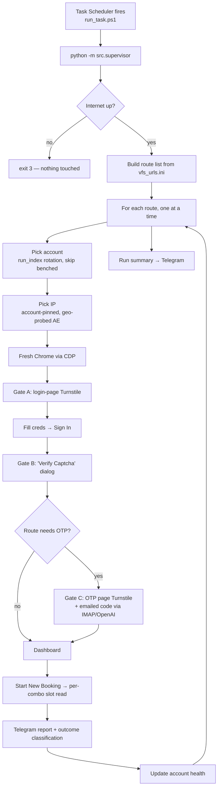

# ARCHITECTURE — VFS Slot Checker

**The master reference for how this system works, end to end, with every branch.**

This document explains *behaviour and decisions*: what fires when, how an account
and an IP are chosen, how Cloudflare is passed, what every possible outcome means,
and who gets penalised for it. For *commands* see [COMMANDS.md](COMMANDS.md) and
[quickCommands.md](quickCommands.md); for the *elevator pitch* see [README.md](README.md).

| | |
|---|---|
| **Purpose** | Log in to VFS Global visa portals, read the "Earliest available slot" for each configured centre / category / sub-category, report to Telegram. **It never books anything.** |
| **Runs on** | Windows 11 + Windows Task Scheduler (an EC2/cron path also exists — see [run_ec2.sh](run_ec2.sh)) |
| **Entry point** | `python -m src.supervisor` |
| **Enabled routes** | 10 (of 12 route files) — see [config/vfs_urls.ini](config/vfs_urls.ini) |
| **Accounts** | 13 in `config/credentials.local.ini` |
| **Proxy pool** | 10 residential UAE IPs in [config/proxylist.txt](config/proxylist.txt) |
| **Last verified against code** | 2026-08-13 |

---

## Table of contents

1. [One-line mental model](#1-one-line-mental-model)
2. [Trigger & scheduling](#2-trigger--scheduling)
3. [Supervisor startup (once per fire)](#3-supervisor-startup-once-per-fire)
4. [Per-route: pick an account, pick an IP](#4-per-route-pick-an-account-pick-an-ip)
5. [Per-route attempt loop](#5-per-route-attempt-loop)
6. [The bot flow: login](#6-the-bot-flow-login)
7. [The three Cloudflare gates](#7-the-three-cloudflare-gates)
8. [Slot check](#8-slot-check)
9. [Outcome matrix — every scenario](#9-outcome-matrix--every-scenario)
10. [Circuit breaker (account health)](#10-circuit-breaker-account-health)
11. [IP rotation within a route](#11-ip-rotation-within-a-route)
12. [Reporting & logs](#12-reporting--logs)
13. [Configuration reference](#13-configuration-reference)
14. [File map](#14-file-map)
15. [Operational notes & gotchas](#15-operational-notes--gotchas)

---

## 1. One-line mental model

> **Schedule → for each route pick a spread-out account + its health-checked UAE IP →
> fresh Chrome → pass Cloudflare (auto, else click the checkbox) → login (+OTP) →
> read each combo's earliest slot → report → classify the outcome and update account
> health — treating IP/network/Cloudflare problems as *infrastructure* (no penalty)
> and only real auth/OTP/block problems as *the account's fault*.**



---

## 2. Trigger & scheduling

Windows Task Scheduler → [run_task.ps1](run_task.ps1) → `python -m src.supervisor`
(no args = **all routes**).

* **Cadence** comes from `[schedule]` in [config/config.local.ini](config/config.ini) and drives
  *both* the scheduler triggers and the account rotation:

  | Setting | Value | Effect |
  |---|---|---|
  | `runs_per_hour` | `2` | fires at `:00` and `:30` |
  | `start_hour` | `9` | first run of the day at 09:00 |
  | `end_hour` | `24` | last run at 23:30 |

  → **30 runs/day**. (The committed reference `config/config.ini` ships `end_hour = 19`;
  the live value in `config.local.ini` wins.) Re-run `setup_task.ps1` after changing
  these — it rebuilds the triggers from the config.

* **Overlap guard.** `run_task.ps1` holds a global mutex (`Global\VfsSlotChecker`),
  the Windows equivalent of `flock`. If the previous tick is still running, this one
  logs *"skipping this tick"* and exits rather than stacking a second Chrome.
* **Requires a live desktop.** Real *headed* Chrome must render, so runs only happen
  while you are logged in with an active session. Asleep / locked / logged out = nothing
  fires, and **there is no catch-up**.
* **Each fire is its own process.** Anything that must survive between runs lives in
  files: `account_health.json`, `waitlist_cooldown.json`.
* **Execution time limit:** 25 minutes per tick (set in `setup_task.ps1`).

---

## 3. Supervisor startup (once per fire)

Order of operations in [src/supervisor.py:625](src/supervisor.py#L625) `main()`:

1. **Load config** → all `config/*.ini` merge, with `config.local.ini` read **last** so it
   overrides everything.
2. **Apply CLI overrides** — `-v` (DEBUG), `--proxy` / `--local` (one-run proxy switch).
3. **Initialise logging** (see [§12](#12-reporting--logs)).
4. **Connectivity gate** — if the PC is offline, **`sys.exit(3)` immediately**: no routes
   touched, no accounts struck, no Telegram noise. The next fire retries.
5. **`warn_unknown_routes()`** — warns for any `routes =` entry in `[credN]` naming a route
   that isn't in `[vfs-url]` (typo guard). A route that exists but is *commented out* is
   logged at DEBUG, not WARNING — a deliberately paused route shouldn't spam every run.
6. **Build the route list** from `[vfs-url]` (uncommented lines only) and run them **one at a
   time**, each in its own fresh Chrome. One route failing never stops the others.
7. **Between routes, re-check connectivity.** If the link drops mid-run, remaining routes are
   skipped (no false strikes) rather than each failing with connection-refused.
8. **At the end:** a run summary to the Telegram summary chat + total proxy traffic for the run.

**Process exit codes**

| Code | Meaning |
|---|---|
| `0` | every route ended `OK` / `SKIPPED` / `PAUSED` |
| `1` | ran, but at least one route failed |
| `3` | skipped entirely — no internet connectivity |

---

## 4. Per-route: pick an account, pick an IP

### 4.1 Credential selection — [src/utils/credentials.py](src/utils/credentials.py)

The route's **eligible pool** = every `[credN]` whose `routes` list contains this route,
**plus** any cred with no `routes` list at all (= registered everywhere), in file order.
Benched/disabled accounts are then removed → the **available pool**.

```
run_index = (hour − start_hour) × runs_per_hour + slot_within_hour
account   = available[ run_index % len(available) ]
```

With `start_hour=9, runs_per_hour=2`: 09:00 → index 0, 09:30 → 1, 10:00 → 2 … Each run of
the day therefore uses a **different** account, and each account recurs only every
`len(available)` runs — as widely spaced as possible, which is the whole point (VFS blocks
accounts that log in too often).

| Situation | Result |
|---|---|
| Available account found | used; label logged as `xx***@domain (cred 3/9)` |
| Eligible accounts exist but **all** benched/disabled | **`PAUSED`** — nothing run, deliberately protecting them |
| No account registered for this route | **`SKIPPED`** |
| `--email` passed (single route only) | forces that account, bypassing rotation |

> **Note:** `credentials.START_HOUR = 6` is a legacy module constant; the live rotation reads
> `start_hour` from `[schedule]`.

### 4.2 Proxy selection — [src/utils/proxy_pool.py](src/utils/proxy_pool.py) `pick_for_run()`

Resolution order:

1. **Master switch off** (`[proxy] enabled = false`, or `--local`, or `VFS_PROXY=off`)
   → direct / this PC's IP.
2. **Route pin** — an entry for this route in `[proxy-routes]` → that exact proxy.
3. **The account's pinned pool IP** — `pool[account_index % len(pool)]` (10 IPs, 13 accounts,
   so each IP hosts ~1–2 accounts). Pinning gives each account a **stable residential
   identity** across all routes and days.

Before an IP is handed to Chrome it is **health-checked once** (`probe_geo`, cached 5 min
per process, via `ip-api.com` — one round-trip returns exit IP *and* country):

| Probe result | Action |
|---|---|
| No response (dead exit) | skip, try the next pool IP |
| Responds, country ≠ `AE` | skip — geo-block risk (403203) |
| Responds, country = `AE` | **used**; logged `proxyseller ip used here : <ip>:<port> [AE]` |
| Responds, country unknown (geo service down) | used anyway — a working exit is never discarded for a failed lookup |
| All pool IPs dead / non-AE | logs an ERROR and **falls back to DIRECT** |

This kills two whole failure classes at the source: mid-run `WinError 10054` (dead exit) and
`403203` geo-blocks (wrong-country exit).

Because Chrome ignores `user:pass` in a proxy URL, authenticated proxies are routed through a
tiny **local auth-forwarder** ([src/utils/proxy_forwarder.py](src/utils/proxy_forwarder.py))
that injects the credentials. It also meters the billed bytes.

---

## 5. Per-route attempt loop

[src/supervisor.py:232](src/supervisor.py#L232) `run()` — up to `max_attempts` (**2**)
attempts, each a **brand-new Chrome**. Per attempt:

1. **`ChromeProcess.start()`** ([src/utils/chrome_launcher.py](src/utils/chrome_launcher.py)) —
   launches real headed Chrome with CDP on port `9222`, a **per-account profile** (so each
   account reuses only its own warm cache and its own IP's `cf_clearance`), and, if proxied,
   the local auth-forwarder.
   *If the cached profile was last used from a different egress IP, the bot is told to drop the
   stale IP-bound `cf_clearance` while keeping the HTTP asset cache.*
2. **The bot attaches over CDP** and runs the flow ([§6](#6-the-bot-flow-login)).
3. **`chrome.close()`** — kills the whole Chrome process tree (the anti-zombie guarantee) and
   collects the bandwidth lines.
4. **Traffic accounting is logged *after* the attempt's pass/fail line**, so it never sits above
   the outcome it belongs to.
5. Between attempts: `backoff_seconds` (**15 s**) pause.

`--keep-open` (debug, single route) forces `max_attempts = 1`, disables IP rotation, and holds
the browser open until you press Enter.

---

## 6. The bot flow: login

[src/vfs_bot/vfs_bot.py](src/vfs_bot/vfs_bot.py) — `run()` → `login()` → `run_slot_check()`.

```
navigate to the login URL
  └─ _check_blocked            ← bail fast on a block page
login():
  ├─ _wait_for_login_form      ← fast-fail poll (15 s), not a blind 120 s wait
  ├─ dismiss the cookie banner
  └─ SAME-IP retry loop (1 + turnstile_signin_retries):
       ├─ _pass_turnstile                       ← GATE A (login-page Turnstile)
       ├─ _fill_credentials (email + password)
       ├─ _click_sign_in                        (normal → force → JS)
       ├─ if the 'Verify Captcha' dialog appears → solve it   ← GATE B
       ├─ _classify_403_responses               (403201 IP block vs stale token)
       ├─ _raise_known_login_errors             (not-registered / invalid / locked / restricted / 429002)
       ├─ if the route is "otp": true → verify_otp            ← GATE C
       └─ await_dashboard_handling_captcha      (~90 s)
reached dashboard → Start New Booking → run_slot_check
```

Key behaviours:

* **Fast-fail waits.** The login-form wait is deliberately short (`login_wait_ms = 15000`) so a
  stuck/blank Cloudflare shell fails fast and the supervisor relaunches a clean browser instead
  of hanging ~2 minutes. A block or "Session Expired" page is caught in ~1.5 s regardless.
* **403 classification.** A `403201` in the Sign-In response is an **IP** block → rotate IP.
  Any *other* 403 is almost always the server rejecting a **stale Turnstile token** → reload
  and re-solve on the **same IP** (`turnstile_signin_retries = 2`). Rotating the IP for a token
  problem would be exactly the wrong move.
* **OTP routes.** Only `AE-GRC` and `AE-ITA` carry `"otp": true`. The code is emailed, fetched
  over IMAP ([src/utils/otp_email.py](src/utils/otp_email.py)) using the **active account's own
  mailbox credentials**, and read out of the email's *image* attachment by OpenAI
  (`gpt-4o-mini`, [src/utils/otp_openai.py](src/utils/otp_openai.py)).
  `read_attempts = 3` re-reads the image in place on an OCR misread; `submit_attempts = 3`
  bounds how many wrong codes are ever submitted to VFS (each wrong submit counts toward VFS's
  own lockout, so this stays small).

---

## 7. The three Cloudflare gates

VFS sits behind Cloudflare, which is why this drives a **real, headed Chrome over CDP** rather
than a headless/automation browser. There are three separate Turnstile challenges in one run:

| | Where | Function | Behaviour |
|---|---|---|---|
| **Gate A** | Login page | `_pass_turnstile` ([vfs_bot.py:530](src/vfs_bot/vfs_bot.py#L530)) | Wait ~10 s for auto-solve. If it doesn't pass, click the checkbox **by coordinates**, anchored on the real Cloudflare `iframe` / `.cf-turnstile` box. Wait again; else reload and retry (`turnstile_refresh_attempts = 2`). Falling back to a click is logged at INFO, with the outcome. |
| **Gate B** | Post-Sign-In "Verify Captcha" dialog | `_do_dismiss_captcha` ([turnstile.py:268](src/vfs_bot/turnstile.py#L268)) | Checks the **dialog-scoped** token, clicks the dialog's own checkbox if it hasn't auto-passed, then Submit — up to `dashboard_captcha_cycles = 3` cycles before declaring a re-challenge loop and abandoning (rather than grinding metered MB for 90 s). |
| **Gate C** | OTP page (OTP routes only) | `verify_otp` ([otp_flow.py](src/vfs_bot/otp_flow.py)) | The OTP form has its own Turnstile. If it never passes → `TurnstileRejectedError`. |

**On a rejected/stale token** (`TurnstileRejectedError`): reload the login page and re-run the
whole flow **on the same IP** a couple of times. Only once those are exhausted does it bubble
up to the supervisor, which then rotates the IP.

> ⚠️ **Do not enable `[bandwidth] block_resource_types`.** Blocking image/media/font shifts the
> checkbox the coordinate-click targets *and* makes the load pattern look suspicious to
> Cloudflare — it breaks the Turnstile solve. It is empty by design.

---

## 8. Slot check

[src/vfs_bot/slot_check.py](src/vfs_bot/slot_check.py) `run_slot_check()`:

1. Wait for `/application-detail` **and** the first `mat-select` to actually render. If
   Cloudflare parks a blank shell, this fails fast and retryable rather than timing out slowly.
2. For each **enabled** combination in `config/routes/<ROUTE>.json`
   (`centre → category → sub_category`), the cascade **re-selects only the dropdown levels that
   changed** from the previous combo — fewer interactions, less traffic, less VFS load.
3. `select_mat_dropdown()` opens the dropdown (force-open if an overlay intercepts the click),
   waits for the panel to populate, then clicks the option (**normal → force → JS**). If VFS's
   loading spinner is stuck it **bails in ~5 s** instead of grinding three long timeouts, and
   logs the options that were actually offered — which is what you need to fix a stale label in
   the route JSON.
4. Read the **"Earliest available slot"** banner → *slot found* / *no availability* /
   *waitlist offered*.
5. Send the per-route slot report to the **success chat** (only meaningful when slots exist).

**Combinations** are declared per route in `config/routes/<ROUTE>.json`; `"disabled": true`
keeps a combo documented but unrun (it is reported as `DISABLED` in the summary).

**Waitlist:** when there's no bookable slot but VFS offers a waitlist, a notice goes to the
success chat, then further notices for the *same destination country* are suppressed for
`[waitlist] cooldown_hours = 2` (state in `waitlist_cooldown.json`) so a country sitting on the
waitlist all day doesn't spam the chat.

---

## 9. Outcome matrix — every scenario

| Scenario | Exception | Retry? | Account health | Route status |
|---|---|---|---|---|
| Slots found / no availability | — | — | **clear strikes** (success) | `OK` |
| A combo's dropdown/spinner errored | *(recorded in results)* | — | success | `OK` — combo reported, not a route failure |
| `403201` IP block | `IpBlockedError` | rotate IP, retry | untouched (it's the IP) | `OK` if a good IP works, else `FAILED` (no bench) |
| Cloudflare/Turnstile never passed | `SignInDisabledError` / `TurnstileRejectedError` | rotate IP, else same-IP | untouched | `FAILED` (infra, no strike) |
| `403203` geo-block | `GeoBlockedError` | no | untouched | `GEO` (alert) |
| Email not registered on this portal | `EmailNotRegisteredError` | no | untouched | `SKIPPED` |
| Wrong password | `InvalidCredentialsError` | no | **DISABLED** (manual clear) | `BLOCKED` (alert) |
| `429002` unauthorised activity | `AccountBlockedError` | no | **DISABLED** | `BLOCKED` (alert) |
| `429001` access restricted | `AccessRestrictedError` | no | benched `hard_cooldown_hours` **on that route** | `RESTRICTED` (alert) |
| `429202` account locked | `AccountLockedError` | no | benched `hard_cooldown_hours` | `LOCKED` (alert) |
| OTP failed (field / email / code) | `OtpVerificationError` | **no attempt 2** | strike (`record_failure`) | `FAILED` (alert) |
| Login form / dashboard / page died | `RetryableError` / unknown | retry `max_attempts` | infra → no strike; genuine stuck → strike | `FAILED` |
| No account available (all cooling) | — | — | — | `PAUSED` |
| No credential registered for route | — | — | — | `SKIPPED` |
| Unsupported route (config problem) | `UnsupportedCountryError` | no | untouched | `FAILED` (alert) |

`ok = True` (and so exit code `0`) only for **`OK`, `SKIPPED`, `PAUSED`**.

### Infra vs. strike

A failed run only strikes the account if it is genuinely the *account's* fault.
[`_is_infra_error()`](src/supervisor.py#L87) classifies as **infrastructure** — fail the run,
**do not penalise the account**:

* **By exception type:** `CdpConnectError`, `LoginFormNotReadyError`, `SignInDisabledError`,
  `TurnstileRejectedError`, `GeoBlockedError`, `IpBlockedError`, `ConnectionReset/Refused/Aborted`,
  `ConnectionError`, `TimeoutError`
* **By message marker:** `WinError 10054/10053/10060/10061/10065`, `connection reset|aborted|refused`,
  `RemoteDisconnected`, `broken pipe`, `chrome exited early`, `cdp endpoint never came up`,
  `ERR_PROXY*`, `ERR_TUNNEL*`, `ERR_CONNECTION*`, `ERR_TIMED_OUT`, `net::ERR*`, `proxy`,
  `forwarder`, `geo-block`, `403203`

Only genuine **auth / OTP / access** errors (invalid creds, 429002, 429001, 429202, OTP failure)
and a genuinely-stuck non-infra run touch account health. A network blip must never bench a
perfectly good account for hours.

---

## 10. Circuit breaker (account health)

[src/utils/account_health.py](src/utils/account_health.py) — state in `account_health.json`
(gitignored, project root, survives across the separate scheduled processes).

Health is tracked **per `(account, route)`**, because VFS runs a *separate portal per
destination country*: a block on Norway usually does **not** affect the same account on
Switzerland. The exception is account-global state (wrong password / 429002), which disables the
account everywhere.

```json
{
  "someone@example.com": {
    "disabled": true, "disabled_at": 1765432100, "disabled_reason": "Invalid credentials",
    "routes": {
      "AE-NOR": { "cooldown_until": 1765440000, "fails": 2,
                  "last_reason": "…", "updated_at": 1765432100 }
    }
  }
}
```

| Mechanism | Trigger | Effect | Clears |
|---|---|---|---|
| **Soft strike** | a genuinely stuck run (non-infra) | `fails += 1` on that route | any success on that route resets to 0 |
| **Soft bench** | `fails` reaches `fail_threshold` (**3**) consecutively on that route | benched `soft_cooldown_hours` (**2 h**) on that route | automatically, on expiry |
| **Hard bench** | `429001` restricted / `429202` locked | benched `hard_cooldown_hours` (**12 h**) on that route immediately | automatically, on expiry |
| **Disable** | wrong credentials / `429002` | **account-global, indefinite** | manual: `python -m src.utils.account_health clear <email>` |

Benched and disabled accounts are skipped by credential selection; other routes and accounts
rotate onward unaffected.

```powershell
# Inspect / clear
& .venv\Scripts\python.exe -m src.utils.account_health
& .venv\Scripts\python.exe -m src.utils.account_health clear someone@example.com
```

---

## 11. IP rotation within a route

On a `403201` IP block **or** "Turnstile not passed", the supervisor calls
`pick_for_run(exclude=tried)` for a **different** pool IP (re-health-checked before use), up to
`max_ip_tries` (**2**) IPs total.

* Rotation happens **without a backoff** and **without an account strike** — it's the IP, not the user.
* If the pool is exhausted (or the run is local/forced):
  * `403201` → **fail the route now**, don't hammer.
  * Turnstile failure → fall through to a **same-IP retry** with a fresh browser, which often passes.

---

## 12. Reporting & logs

### Telegram — two channels

| Channel | Config keys | Carries |
|---|---|---|
| **Success chat** | `bot_token`, `TELEGRAM_chat_id` | per-route slot reports (sent by the bot; only meaningful when slots exist), waitlist notices |
| **Summary chat** | `TELEGRAM_SUMMARY_BOT_TOKEN`, `TELEGRAM_SUMMARY_CHAT_ID` | failure / `GEO` / `LOCKED` / `RESTRICTED` / `BLOCKED` alerts, **and the run summary after every fire** |

Message layout lives in [src/utils/telegram_message.py](src/utils/telegram_message.py).
The run summary carries one line per route: status icon, slots grouped by visa type,
disabled combos, the account used, the IP used, and any combo-error sub-lines.
*(The "Link to visa center site" line was removed from failure alerts.)*

### Log files

| File | Mode | Contents |
|---|---|---|
| `app.log` | **truncated each run** (`mode="w"`) | the current process's detailed step-by-step log — the one to read live |
| `logs/app-YYYY-MM-DD.log` | appended | per-day archive; every run of that day appends. The date is fixed at startup, so no midnight-rollover logic is needed |
| `task_runner.log` | appended | the PowerShell wrapper's start / finish / exit-code / *"skipped (overlap)"* lines — proof the task actually fired |
| `task_stderr.log` | overwritten | the child's raw stderr; safety net for a crash *before* Python logging starts |

Level notes: a route's final status is logged at **ERROR** when it's a genuine failure
(`FAILED`/`GEO`/`BLOCKED`/`LOCKED`/`RESTRICTED`) and INFO for `OK`/`SKIPPED`/`PAUSED`;
Turnstile checkbox fallbacks log at INFO. `-v` switches everything to DEBUG.
Each run ends with a `━━━━━━━━━━━━━━` divider in the log (log-file only, never in Telegram).

---

## 13. Configuration reference

Every `config/*.ini` is loaded; **`config.local.ini` is read last and overrides everything**.
`config.ini` is the committed, documented template with blank secrets — never put real tokens in it.

### Files

| File | Committed? | Purpose |
|---|---|---|
| `config/config.ini` | ✅ | documented reference template, safe defaults, blank secrets |
| `config/config.local.ini` | ❌ gitignored | **the live settings** — tokens, keys, real values |
| `config/credentials.local.ini` | ❌ gitignored | `[credN]` accounts: `email`, `password`, optional `routes` |
| `config/proxies.local.ini` | ❌ gitignored | optional `[proxy-pool] list` / `[proxy-routes]` pins |
| `config/proxylist.txt` | ❌ gitignored | the IP pool — `user:pass@host:port`, `host:port`, provider CSV, or 4-field colon format |
| `config/vfs_urls.ini` | ✅ | `[vfs-url]` route → login URL; **comment a line to pause that country** |
| `config/routes/<ROUTE>.json` | ✅ | per-route combinations, `"otp": true` flag, selectors/schema |

### Live values

| Section | Key | Value | Meaning |
|---|---|---|---|
| `[schedule]` | `runs_per_hour` / `start_hour` / `end_hour` | `2` / `9` / `24` | :00 & :30, 09:00–23:30 → 30 runs/day |
| `[proxy]` | `enabled` | `true` | use the residential pool (`--local` overrides for one run) |
| | `require_country` | `AE` | exits outside UAE are skipped; blank disables the check |
| `[account_safety]` | `hard_cooldown_hours` | `12` | bench length for 429001 / 429202 |
| | `soft_cooldown_hours` | `2` | bench length after consecutive strikes |
| | `fail_threshold` | `3` | strikes before a soft bench |
| | `max_attempts` | `2` | in-run browser relaunches |
| `[waitlist]` | `cooldown_hours` | `2` | per-country waitlist notice suppression |
| `[timeouts]` | `page_load_ms` | `60000` | navigating to the login URL |
| | `login_wait_ms` | `15000` | login form appears (short = fail fast) |
| | `relogin_wait_ms` | `45000` | form re-appears after a reload |
| | `dashboard_ms` | `90000` | await dashboard while handling captcha |
| | `slot_read_ms` | `12000` | read the slot banner |
| `[retry]` | `backoff_seconds` | `15` | pause between relaunch attempts |
| | `max_ip_tries` | `2` | different IPs on a 403201 |
| | `turnstile_refresh_attempts` | `2` | page reloads to unstick Gate A |
| | `turnstile_signin_retries` | `2` | same-IP re-solves on a stale token |
| | `session_refresh_attempts` | `1` | refreshes on "Session Expired" |
| | `dashboard_captcha_cycles` | `3` | Gate B re-solve cycles |
| | `cdp_port` | `9222` | Chrome remote-debugging port |
| `[otp]` | `timeout_seconds` / `poll_seconds` | `120` / `5` | how long to wait for the OTP email |
| | `read_attempts` / `submit_attempts` | `3` / `3` | OCR re-reads / submissions to VFS |
| `[openai]` | `model` | `gpt-4o-mini` | reads the OTP out of the email image |
| | `request_timeout_seconds` | `18` | short, so a hang re-reads instead of relaunching |
| `[bandwidth]` | `log_usage` | `true` | per-route browser + billed proxy traffic |
| | `mute_chrome` | `true` | disable Chrome's SafeBrowsing / telemetry / component traffic |
| | `block_resource_types` | *(empty)* | **keep empty — blocking assets breaks Turnstile** |
| | `persist_cache` / `cache_size_mb` | `true` / `128` | per-account disk cache: the biggest safe proxy saving |
| `[logging]` | `level` / `browser_activity` | `INFO` / `false` | |

### CLI

```powershell
& .venv\Scripts\python.exe -m src.supervisor                    # all routes (what the scheduler runs)
& .venv\Scripts\python.exe -m src.supervisor -sc AE -dc FRA     # one route
& .venv\Scripts\python.exe -m src.supervisor -sc AE -dc FRA -v  # + DEBUG logs
```

| Flag | Effect |
|---|---|
| `-sc` / `-dc` | run a single route; omit both for all routes |
| `-v` | DEBUG step-by-step logging |
| `--proxy` / `--local` | force proxy on / off for this run (mutually exclusive) |
| `--email` (+ `--password`) | **test:** force a specific account (single route only) |
| `--proxy-url` | **test:** force a proxy URL (single route only) |
| `--keep-open` | **debug:** leave the browser open at the end; disables retries and IP rotation |

Editors (bind to `127.0.0.1` only, each Save writes a timestamped `.bak-*` first):

```powershell
& .venv\Scripts\python.exe config_editor.py        # http://127.0.0.1:8766  → config.local.ini
& .venv\Scripts\python.exe credentials_editor.py   # http://127.0.0.1:8765  → credentials.local.ini + vfs_urls.ini
```

---

## 14. File map

```
src/
  supervisor.py            # THE orchestrator: routes → account → IP → attempts → outcomes → summary
  main.py                  # single-route entry point + logging setup
  settings.py              # typed/validated view over the ini config
  utils/
    credentials.py         # [credN] pool, per-route eligibility, run_index rotation
    account_health.py      # circuit breaker: strikes, soft/hard bench, disable (account_health.json)
    proxy_pool.py          # IP pool, account pinning, probe_geo health+region check
    proxy_forwarder.py     # local auth-injecting proxy (Chrome ignores user:pass) + byte metering
    chrome_launcher.py     # ChromeProcess: launch real headed Chrome w/ CDP, per-account profile, kill tree
    connectivity.py        # startup + between-route internet gate
    config_reader.py       # merges config/*.ini (local last)
    route_schema.py        # loads config/routes/<ROUTE>.json
    otp_email.py           # IMAP fetch of the OTP email
    otp_openai.py          # reads the OTP out of the email's image attachment
    otp_service.py         # orchestrates fetch → read → retry
    greece_otp.py          # Greece-specific OTP handling
    telegram.py            # transport (success + summary channels)
    telegram_message.py    # message layout: slot report, failure alert, run summary
    waitlist_cooldown.py   # per-country waitlist notice suppression (waitlist_cooldown.json)
    analytics.py           # traffic / run stats helpers
    show_schedule.py       # preview which account runs when
  slots/                   # slot HISTORY: the permanent record + the agent board
    schema.sql             # SQLite tables (combos, runs, checks, slot_dates, events)
    db.py                  # connection (WAL) + forward-only migrations
    parse.py               # banner text → outcome + dates per party size (pure)
    registry.py            # config/routes/*.json → canonical combos; label → combo
    events.py              # opened / closed / date_moved between checks (pure)
    store.py               # the only writer; failure-isolated API for the bot
    logreader.py           # log files → checks (for seeding history)
    seed.py                # idempotent backfill
    query.py               # the ranking/wait/availability numbers
    dashboard.py           # builds reports/slot_dashboard.html (the desk tool)
    wall.py                # builds reports/slot_wall.html (the office screen)
  vfs_bot/
    vfs_bot.py             # the flow: run → login → gates → dashboard (re-exports errors)
    vfs_bot_factory.py     # route → bot instance (UnsupportedCountryError)
    errors.py              # the failure taxonomy (see §9)
    turnstile.py           # all three Cloudflare gates + dashboard awaiting
    slot_check.py          # dropdown cascade + "Earliest available slot" read + report
    otp_flow.py            # OTP page: Gate C + code entry
    block_detection.py     # 403201 / 403203 / 429001 / 429002 / 429202 page + response detection
    session.py             # session-expired handling
    browser_setup.py       # CDP attach, context, instrumentation
    dom_utils.py           # click/fill helpers (normal → force → JS)
    diagnostics.py         # screenshots on failure
    waitlist.py            # waitlist detection + counting

config/                    # see §13
tests/                     # pytest suite: 403 classification, captcha loop, OTP retry,
                           # slot check, waitlist, connectivity, bandwidth, settings, smoke
run_task.ps1               # Task Scheduler entry point (mutex overlap guard)
setup_task.ps1             # (re)registers the scheduled task FROM [schedule] config
show_schedule.ps1          # print the day's account rotation
run_ec2.sh / EC2_COMMANDS.md  # the Linux/cron/Xvfb path
account_health.json        # circuit-breaker state (gitignored)
waitlist_cooldown.json     # waitlist suppression state (gitignored)
```

Run the tests with:

```powershell
& .venv\Scripts\python.exe -m pytest -q
```

---

## 15. Operational notes & gotchas

* **No live desktop = no runs.** The machine must be awake and logged in; headed Chrome has to
  render. There is no catch-up for missed ticks.
* **Never enable `block_resource_types`.** It breaks the Turnstile solve (see [§7](#7-the-three-cloudflare-gates)).
* **Bandwidth is billed.** The proxy is metered, so every byte Chrome fetches costs money. That's
  why `mute_chrome`, `persist_cache`, short OpenAI/Turnstile timeouts, and the "bail fast instead
  of grinding" behaviours exist. Each run logs `Total proxy traffic this run: X MB`.
* **A stale combo label looks like a bug but isn't.** If VFS renames a centre/category, the
  dropdown click fails and the log prints *the options that were actually offered* — copy the new
  text into `config/routes/<ROUTE>.json`.
* **`PAUSED` is not a failure.** It means every eligible account for that route is cooling down and
  the system deliberately held off. It doesn't affect the exit code.
* **A disabled account never clears itself.** Wrong password / 429002 requires a human:
  fix the credential, then `python -m src.utils.account_health clear <email>`.
* **Adding a country:** add the login URL to `[vfs-url]`, create `config/routes/AE-XXX.json` with
  the real dropdown values (and `"otp": true` if the portal emails a code), and list the route in
  the relevant `[credN] routes =` entries. `warn_unknown_routes()` will flag typos on the next run.
* **Pausing a country:** comment out its line in `config/vfs_urls.ini`. Creds still listing it are
  logged at DEBUG, not warned about.
* **Changing the schedule:** edit `[schedule]`, then re-run `setup_task.ps1` — it rebuilds the
  triggers *and* the rotation spread from that one setting.
